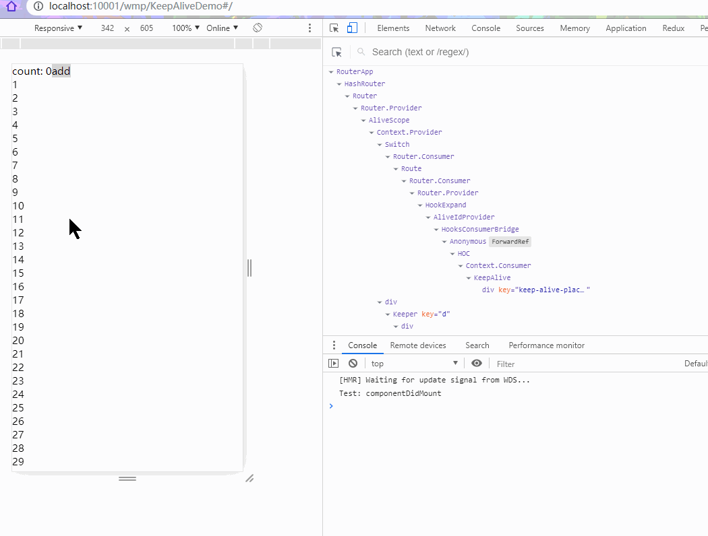

# React Activation

Vue 中 `<keep-alive />` 功能在 React 中的实现

- - -

功能与 [react-keep-alive](https://github.com/StructureBuilder/react-keep-alive) 相同

但修复了 https://github.com/StructureBuilder/react-keep-alive/issues/36 中的大部分问题

配合 babel 预编译实现更稳定的 KeepAlive 功能



- - -

## 兼容性

React v16+

兼容 SSR

- - -

## 安装

```bash
yarn add react-activation
# or
npm install react-activation
```
- - -

## 使用方式

`.babelrc` 中增加 `react-activation/babel` 插件

该插件会在各 JSX 元素上增加 `_ka` 属性，帮助 KeepAlive 运行时按渲染位置唯一的生成缓存 id 标识

```javascript
{
  "plugins": [
    "react-activation/babel"
  ]
}
```

业务代码中

```javascript
import React, { Component, useState } from 'react'
import ReactDOM from 'react-dom'
import KeepAlive, { AliveScope, withActivation } from 'react-activation'

@withActivation
class Test extends Component {
  state = {
    count: 0
  }

  setCount = count => this.setState({ count })

  componentDidActivate() {
    console.log('Test: componentDidActivate')
  }

  componentWillUnactivate() {
    console.log('Test: componentWillUnactivate')
  }

  render() {
    const { count } = this.state
    
    return (
      <div>
        count: {count}
        <button onClick={() => this.setCount(count + 1)}>add</button>
      </div>
    )
  }
}

function App() {
  const [show, setShow] = useState(true)

  return (
    <AliveScope>
      <button onClick={() => setShow(show => !show)}>Toggle</button>
      {show && (
        <KeepAlive>
          <Test />
        </KeepAlive>
      )}
    </AliveScope>
  )
}

ReactDOM.render(<App />, document.getElementById('root'))
```

- - -

## 生命周期

`ClassComponent` 可配合 `withActivation` 装饰器

使用 `componentDidActivate` 与 `componentWillUnactivate` 对应激活与缓存两种状态

`FunctionComponent` 则分别使用 `useActivate` 与 `useUnactivate` hooks 钩子

```javascript
...
import KeepAlive, { useActivate, useUnactivate， withActivation } from 'react-activation'

@withActivation
class TestClass extends Component {
  ...
  componentDidActivate() {
    console.log('TestClass: componentDidActivate')
  }

  componentWillUnactivate() {
    console.log('TestClass: componentWillUnactivate')
  }
  ...
}
...
function TestFunction() {
  useActivate(() => {
    console.log('TestFunction: didActivate')
  })

  useUnactivate(() => {
    console.log('TestFunction: willUnactivate')
  })
  ...
}
...
function App() {
  ...
  return (
    {show && (
      <KeepAlive>
        <TestClass />
        <TestFunction />
      </KeepAlive>
    )}
  )
}
...
```

- - -

## 手动控制缓存

1. 给需要控制缓存的 `<KeepAlive />` 标签增加 `name` 属性

2. 使用 `withAliveScope` 或 `useAliveController` 获取控制函数

   - **drop(name)**: 按 name 卸载缓存，name 可选类型为 `String` 或 `RegExp`，注意，仅卸载命中KeepAlive 的第一层内容，不会卸载 KeepAlive 中嵌套的、未命中的 KeepAlive
   - **dropScope(name)**：按 name 卸载缓存，name 可选类型为 `String` 或 `RegExp`，将卸载命中KeepAlive 的所有内容，包括 KeepAlive 中嵌套的所有 KeepAlive
   - **clear()**：将清空所有缓存中的 KeepAlive
   - **getCachingNodes()**：获取所有缓存中的节点

```javascript
...
import { withAliveScope, useAliveController } from 'react-activation'
...
function App() {
  const { drop, dropScope, clear, getCachingNodes } = useAliveController()

  return (
    ...
  )
}
// or
@withAliveScope
class App extends Component {
  render() {
    const { drop, dropScope, clear, getCachingNodes } = this.props

    return (
      ...
    )
  }
}
...
```

- - -

## 注意：对 Context 的破坏性影响，需手动修复

问题参考：https://github.com/StructureBuilder/react-keep-alive/issues/36

修复方式

1. 使用从 `react-activation` 导出的 `createContext` 创建上下文
2. 使用从 `react-activation` 导出的 `fixContext` 修复受影响的上下文

```javascript
...
import { createContext } from 'react-activation'

const { Provider, Consumer } = createContext()
...
// or
...
import { createContext } from 'react'
import { fixContext } from 'react-activation'

const Context = createContext()
const { Provider, Consumer } = Context

fixContext(Context)
...
```