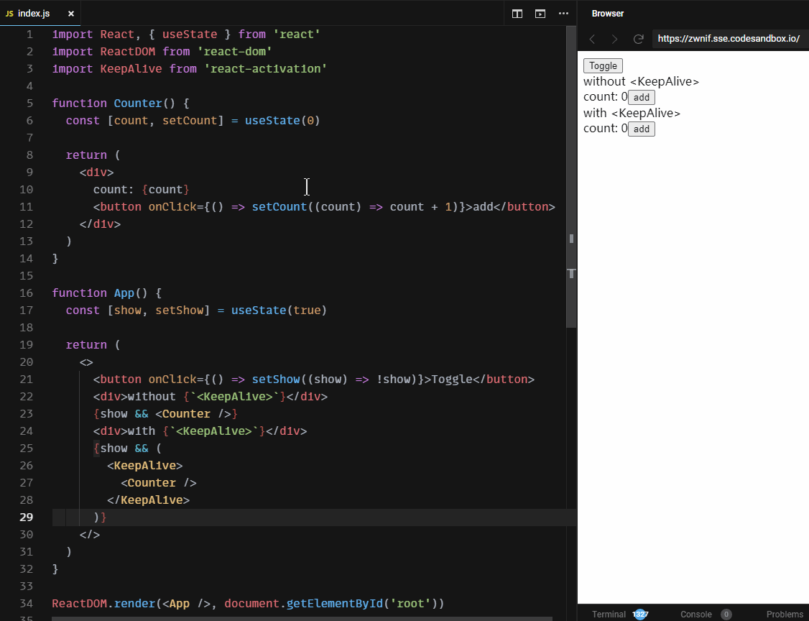
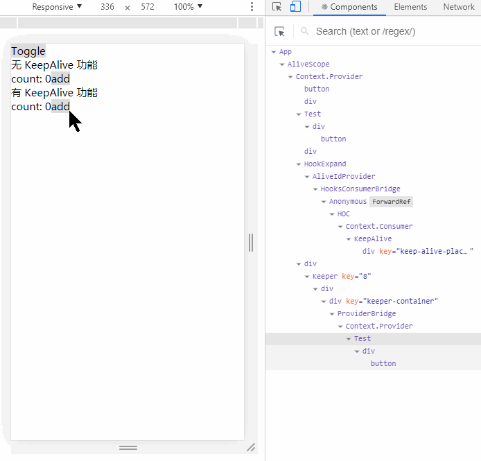

### 注意

- 不要使用 `<React.StrictMode />` 严格模式
- (React v18+) 不要使用 `ReactDOMClient.createRoot`, 而是使用 `ReactDOM.render`, https://github.com/CJY0208/react-activation/issues/225#issuecomment-1311136388

# React Activation

[](https://bundlephobia.com/result?p=react-activation@latest)
[](https://github.com/CJY0208/react-activation)


[English](./README.md) | 中文说明

Vue 中 `<keep-alive />` 功能在 React 中的黑客实现

建议关注 `React 18.x` 中的官方实现 [`<Offscreen />`](https://github.com/reactwg/react-18/discussions/19)

---

配合 babel 预编译实现更稳定的 KeepAlive 功能

[实现原理说明 - 想读源码的同学关注这里~](https://github.com/CJY0208/react-activation/blob/master/README_CN.md#%E5%8E%9F%E7%90%86%E6%A6%82%E8%BF%B0)

[在线 Demo](https://codesandbox.io/s/affectionate-beaver-solkt)



---

## 更多复杂示例

- [可关闭的路由 tabs 示例](https://codesandbox.io/s/keguanbideyifangwenluyou-tab-shilikeanluyoucanshufenduofenhuancun-ewycx)
- [可关闭的路由 tabs 示例（`umijs`）](https://codesandbox.io/s/umi-keep-alive-tabs-demo-knfxy)
- [使用路由转场动画](https://codesandbox.io/s/luyouzhuanchangdonghuashili-jdhq1)

---

## 兼容性

- React v16 / v17 / v18

- Preact v10+

- 兼容 SSR

---

## 安装

```bash
yarn add react-activation
# 或者
npm install react-activation
```

---

## 使用方式

#### 1. （可选，建议）babel 配置文件 `.babelrc` 中增加 `react-activation/babel` 插件

[为什么需要它？](https://github.com/CJY0208/react-activation/issues/18#issuecomment-564360695)

该插件将借助 [`react-node-key`](https://github.com/CJY0208/react-node-key) 于编译阶段在各 JSX 元素上增加 `_nk` 属性，帮助 `react-activation` 在运行时**按渲染位置生成唯一的缓存 id 标识**

```javascript
{
  "plugins": [
    "react-activation/babel"
  ]
}
```

（0.11.0+）如果不使用 babel，建议给每个 `<KeepAlive>` 声明全局唯一且不变的 `cacheKey` 属性，以确保缓存的稳定性，如下

```jsx
<KeepAlive cacheKey="UNIQUE_ID" />
```

#### 2. 用 `<KeepAlive>` 包裹需要保持状态的组件

如例子中的 `<Counter>` 组件

```javascript
// App.js

import React, { useState } from 'react'
import KeepAlive from 'react-activation'

function Counter() {
  const [count, setCount] = useState(0)

  return (
    <div>
      <p>count: {count}</p>
      <button onClick={() => setCount(count => count + 1)}>Add</button>
    </div>
  )
}

function App() {
  const [show, setShow] = useState(true)

  return (
    <div>
      <button onClick={() => setShow(show => !show)}>Toggle</button>
      {show && (
        <KeepAlive>
          <Counter />
        </KeepAlive>
      )}
    </div>
  )
}

export default App
```

##### 3. 在不会被销毁的位置放置 `<AliveScope>` 外层，一般为应用入口处

注意：与 `react-router` 或 `react-redux` 配合使用时，建议将 `<AliveScope>` 放置在 `<Router>` 或 `<Provider>` 内部

```javascript
// index.js

import React from 'react'
import ReactDOM from 'react-dom'
import { AliveScope } from 'react-activation'

import App from './App'

ReactDOM.render(
  <AliveScope>
    <App />
  </AliveScope>,
  document.getElementById('root')
)
```

---

## 生命周期

`ClassComponent` 可配合 `withActivation` 装饰器

使用 `componentDidActivate` 与 `componentWillUnactivate` 对应激活与缓存两种状态

`FunctionComponent` 则分别使用 `useActivate` 与 `useUnactivate` hooks 钩子

```javascript
...
import KeepAlive, { useActivate, useUnactivate, withActivation } from 'react-activation'

@withActivation
class TestClass extends Component {
  ...
  componentDidActivate() {
    console.log('TestClass: componentDidActivate')
  }

  componentWillUnactivate() {
    console.log('TestClass: componentWillUnactivate')
  }
  ...
}
...
function TestFunction() {
  useActivate(() => {
    console.log('TestFunction: didActivate')
  })

  useUnactivate(() => {
    console.log('TestFunction: willUnactivate')
  })
  ...
}
...
function App() {
  ...
  return (
    {show && (
      <KeepAlive>
        <TestClass />
        <TestFunction />
      </KeepAlive>
    )}
  )
}
...
```

---

## 缓存控制

### 手动控制缓存

1. 给需要控制缓存的 `<KeepAlive />` 标签增加 `name` 属性

2. 使用 `withAliveScope` 或 `useAliveController` 获取控制函数

   - **drop(name)**: （"卸载"仅可用于缓存状态下的节点，如果节点没有被缓存但需要清空缓存状态，请使用 “刷新” 控制）

     按 name 卸载缓存状态下的 `<KeepAlive>` 节点，name 可选类型为 `String` 或 `RegExp`，注意，仅卸载命中 `<KeepAlive>` 的第一层内容，不会卸载 `<KeepAlive>` 中嵌套的、未命中的 `<KeepAlive>`

   - **dropScope(name)**: （"卸载"仅可用于缓存状态下的节点，如果节点没有被缓存但需要清空缓存状态，请使用 “刷新” 控制）

     按 name 卸载缓存状态下的 `<KeepAlive>` 节点，name 可选类型为 `String` 或 `RegExp`，将卸载命中 `<KeepAlive>` 的所有内容，包括 `<KeepAlive>` 中嵌套的所有 `<KeepAlive>`

   - **refresh(name)**:

     按 name 刷新缓存状态下的 `<KeepAlive>` 节点，name 可选类型为 `String` 或 `RegExp`，注意，仅刷新命中 `<KeepAlive>` 的第一层内容，不会刷新 `<KeepAlive>` 中嵌套的、未命中的 `<KeepAlive>`

   - **refreshScope(name)**:

     按 name 刷新缓存状态下的 `<KeepAlive>` 节点，name 可选类型为 `String` 或 `RegExp`，将刷新命中 `<KeepAlive>` 的所有内容，包括 `<KeepAlive>` 中嵌套的所有 `<KeepAlive>`

   - **clear()**:

     将清空所有缓存中的 KeepAlive


    - **getCachingNodes()**:

      获取所有缓存中的节点

```javascript
...
import KeepAlive, { withAliveScope, useAliveController } from 'react-activation'
...
<KeepAlive name="Test">
  ...
    <KeepAlive>
      ...
        <KeepAlive>
          ...
        </KeepAlive>
      ...
    </KeepAlive>
  ...
</KeepAlive>
...
function App() {
  const { drop, dropScope, clear, getCachingNodes } = useAliveController()

  useEffect(() => {
    drop('Test')
    // or
    drop(/Test/)
    // or
    dropScope('Test')

    clear()
  })

  return (
    ...
  )
}
// or
@withAliveScope
class App extends Component {
  render() {
    const { drop, dropScope, clear, getCachingNodes } = this.props

    return (
      ...
    )
  }
}
...
```

---

### 自动控制缓存

给需要控制缓存的 `<KeepAlive />` 标签增加 `when` 属性，取值如下

#### 当 `when` 类型为 `Boolean` 时

- **true**: 卸载时缓存
- **false**: 卸载时不缓存

```javascript
<KeepAlive when={true}>
```

#### 当 `when` 类型为 `Array` 时

**第 1 位**参数表示是否需要在卸载时缓存

**第 2 位**参数表示是否卸载 `<KeepAlive>` 的所有缓存内容，包括 `<KeepAlive>` 中嵌套的所有 `<KeepAlive>`

```javascript
// 例如：以下表示卸载时不缓存，并卸载掉嵌套的所有 `<KeepAlive>`
<KeepAlive when={[false, true]}>
  ...
  <KeepAlive>
    ...
    <KeepAlive>...</KeepAlive>
    ...
  </KeepAlive>
  ...
</KeepAlive>
```

#### 当 `when` 类型为 `Function` 时（**建议使用这种方式**）

返回值为上述 `Boolean` 或 `Array`，依照上述说明生效

但 `when` 的最终计算时机调整到 `<KeepAlive>` 组件 `componentWillUnmount` 时，可避免大部分 when 属性没有达到预期效果的问题

```jsx
<KeepAlive when={() => true}>
<KeepAlive when={() => [false, true]}>
```

---

## 多份缓存

同一个父节点下，相同位置的 `<KeepAlive>` 默认会使用同一份缓存

例如下述的带参数路由场景，`/item` 路由会按 `id` 来做不同呈现，但只能保留同一份缓存

```javascript
<Route
  path="/item/:id"
  render={props => (
    <KeepAlive>
      <Item {...props} />
    </KeepAlive>
  )}
/>
```

---

类似场景，可以使用 `<KeepAlive>` 的 `id` 属性，来实现按特定条件分成多份缓存

```javascript
<Route
  path="/item/:id"
  render={props => (
    <KeepAlive id={props.match.params.id}>
      <Item {...props} />
    </KeepAlive>
  )}
/>
```

## 保存滚动位置（默认为 `true`）

`<KeepAlive />` 会检测它的 `children` 属性中是否存在可滚动的元素，然后在 `componentWillUnactivate` 之前自动保存滚动位置，在 `componentDidActivate` 之后恢复保存的滚动位置

如果你不需要 `<KeepAlive />` 做这件事，可以将 `saveScrollPosition` 属性设置为 `false`

```javascript
<KeepAlive saveScrollPosition={false} />
```

如果你的组件共享了屏幕滚动容器如 `document.body` 或 `document.documentElement`, 将 `saveScrollPosition` 属性设置为 `"screen"` 可以在 `componentWillUnactivate` 之前自动保存共享屏幕容器的滚动位置

```javascript
<KeepAlive saveScrollPosition="screen" />
```

---

## 原理概述

将 `<KeepAlive />` 的 `children` 属性传递到 `<AliveScope />` 中，通过 `<Keeper />` 进行渲染

`<Keeper />` 完成渲染后通过 `DOM` 操作，将内容转移到 `<KeepAlive />` 中

由于 `<Keeper />` 不会被卸载，故能实现缓存功能

[最简实现示例](https://codesandbox.io/s/zuijian-react-keepalive-shixian-ovh90)

围绕最简实现，本仓库后续代码主要集中在

1. 借助 React 的上下文实现生命周期机制
  
2. 借助[桥接机制](https://github.com/StructureBuilder/react-keep-alive/issues/36#issuecomment-527490445)修复断层
  
3. 借助 babel 标记各节点，建立[渲染坐标系](https://github.com/CJY0208/react-node-key/issues/3)来增强[稳定性](https://github.com/CJY0208/react-activation/issues/18#issuecomment-564360695)

**（源码欢迎微信讨论 375564567，欢迎 PR）**



---

## Breaking Change 由实现原理引发的额外问题

1. `<KeepAlive />` 中需要有一个将 children 传递到 `<AliveScope />` 的动作，故真实内容的渲染会相较于正常情况**慢一拍**

   将会对严格依赖生命周期顺序的功能造成一定影响，例如 `componentDidMount` 中 ref 的取值，如下

   ```javascript
   class Test extends Component {
     componentDidMount() {
       console.log(this.outside) // will log <div /> instance
       console.log(this.inside) // will log undefined
     }

     render() {
       return (
         <div>
           <div
             ref={ref => {
               this.outside = ref
             }}
           >
             Outside KeepAlive
           </div>
           <KeepAlive>
             <div
               ref={ref => {
                 this.inside = ref
               }}
             >
               Inside KeepAlive
             </div>
           </KeepAlive>
         </div>
       )
     }
   }
   ```

   `ClassComponent` 中上述错误可通过利用 `withActivation` 高阶组件修复

   `FunctionComponent` 目前暂无处理方式，可使用 `setTimeout` 或 `nextTick` 延时获取 `ref`

   ```javascript
   @withActivation
   class Test extends Component {
     componentDidMount() {
       console.log(this.outside) // will log <div /> instance
       console.log(this.inside) // will log <div /> instance
     }

     render() {
       return (
         <div>
           <div
             ref={ref => {
               this.outside = ref
             }}
           >
             Outside KeepAlive
           </div>
           <KeepAlive>
             <div
               ref={ref => {
                 this.inside = ref
               }}
             >
               Inside KeepAlive
             </div>
           </KeepAlive>
         </div>
       )
     }
   }
   ```

2. 对 Context 的破坏性影响
   
   react-actication@0.8.0 版本后 React 16.3+ 版本中已自动修复

   react-actication@0.8.0 版本配合 React 17+ 需要做如下调整以达到自动修复效果

   ```jsx
   import { autoFixContext } from 'react-activation'

   autoFixContext(
    [require('react/jsx-runtime'), 'jsx', 'jsxs', 'jsxDEV'],
    [require('react/jsx-dev-runtime'), 'jsx', 'jsxs', 'jsxDEV']
   )
   ```
   
   react-actication@0.8.0 以下版本需手动修复，参考以下

   问题情景参考：https://github.com/StructureBuilder/react-keep-alive/issues/36

   ```jsx
   <Provider value={1}>
     {show && (
       <KeepAlive>
         <Consumer>
           {(
             context // 由于渲染层级被破坏，此处无法正常获取 context
           ) => <Test contextValue={context} />}
         </Consumer>
       </KeepAlive>
     )}
     <button onClick={toggle}>toggle</button>
   </Provider>
   ```

   修复方式任选一种

   - 使用从 `react-activation` 导出的 `createContext` 创建上下文

   - 使用从 `react-activation` 导出的 `fixContext` 修复受影响的上下文

   ```javascript
   ...
   import { createContext } from 'react-activation'

   const { Provider, Consumer } = createContext()
   ...
   // or
   ...
   import { createContext } from 'react'
   import { fixContext } from 'react-activation'

   const Context = createContext()
   const { Provider, Consumer } = Context

   fixContext(Context)
   ...
   ```

3. 对依赖于 React 层级的功能造成影响，如下

   - [x] [react-router 的 withRouter/hooks 功能异常修正](https://github.com/CJY0208/react-activation/issues/77)
   - [x] ~~Error Boundaries~~（已修复）
   - [x] ~~React.Suspense & React.lazy~~（已修复）
   - [ ] React 合成事件冒泡失效
   - [ ] 其他未发现的功能
